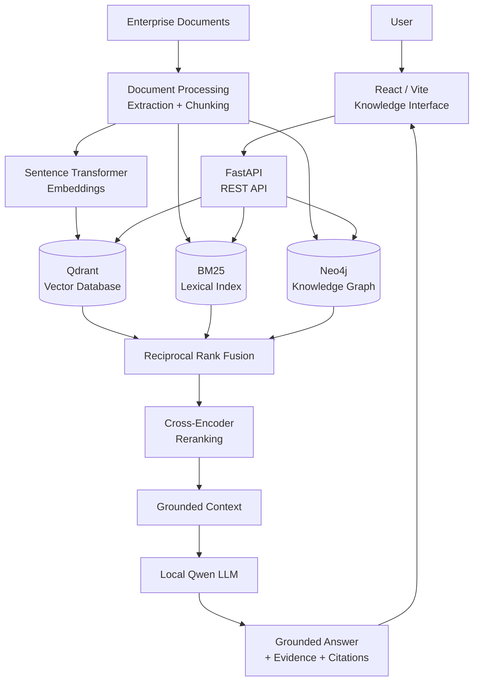
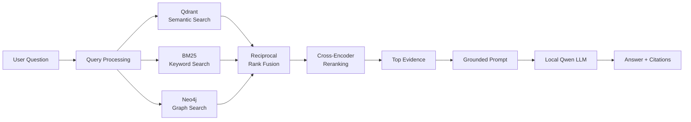
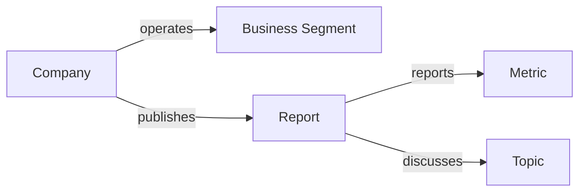
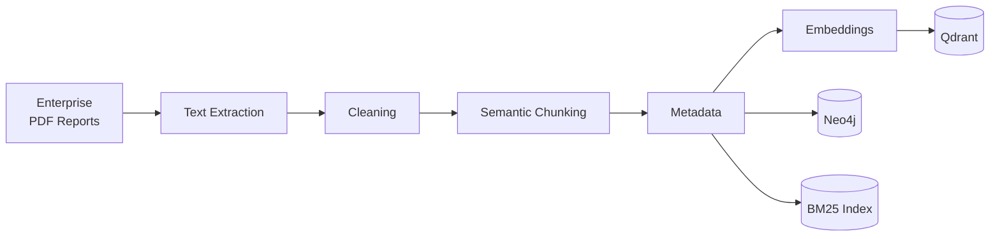
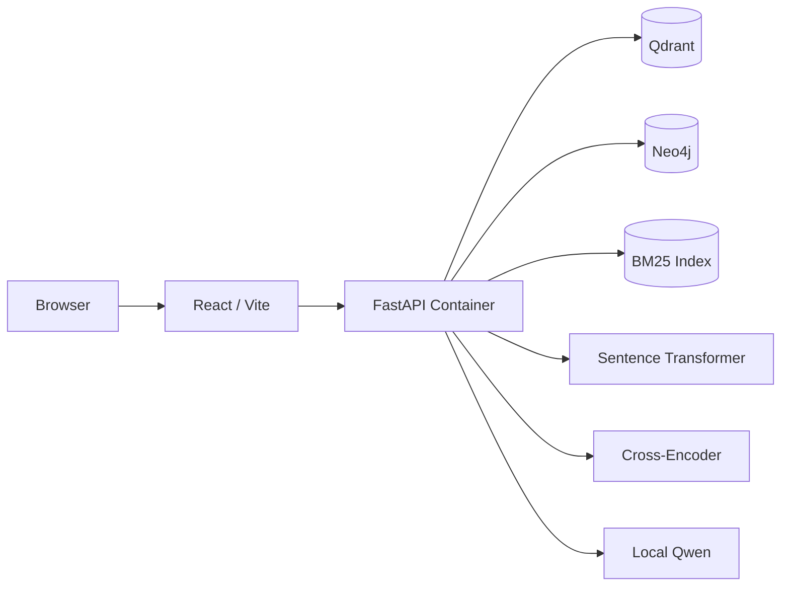

# NexaGraph

### Enterprise GraphRAG Knowledge Intelligence Platform

> A local, open-source GraphRAG system that fuses **semantic search (Qdrant), lexical search (BM25), and graph retrieval (Neo4j)** with **Reciprocal Rank Fusion** and **cross-encoder reranking**, then generates grounded, citable answers with a **local Qwen LLM**, with no paid AI APIs.

[](https://www.python.org/)
[](https://fastapi.tiangolo.com/)
[](https://react.dev/)
[](https://qdrant.tech/)
[](https://neo4j.com/)
[](https://www.docker.com/)
[](https://huggingface.co/)

| Corpus | Chunks | Retrieval signals | Document Recall@5 | LLM |
|:---:|:---:|:---:|:---:|:---:|
| 5 Siemens 2025 reports | ~1,678 | Semantic + BM25 + Graph | **100%** (evaluated query set) | Local Qwen |

---

## Table of Contents

- [Why NexaGraph?](#why-nexagraph)
- [System Architecture](#system-architecture)
- [Retrieval Pipeline](#retrieval-pipeline)
- [Document Ingestion](#document-ingestion)
- [Knowledge Corpus](#knowledge-corpus)
- [Evaluation](#evaluation)
- [Design Decisions](#design-decisions)
- [Local AI](#local-ai)
- [Frontend and Backend](#frontend-and-backend)
- [Getting Started](#getting-started)
- [Project Structure](#project-structure)
- [Grounding Strategy](#grounding-strategy)
- [Limitations](#limitations)
- [Future Work](#future-work)
- [Author](#author)

---

## Why NexaGraph?

A conventional RAG system is a single retrieval call:

```text
Query -> Vector Search -> Top-K -> LLM -> Answer
```

That works for straightforward semantic questions. Enterprise questions are harder:

> *"How did the company's digital transformation strategy affect its business segments?"*

A good answer needs several kinds of evidence at once:

| Need | Signal that provides it |
|---|---|
| Conceptual similarity ("environmental strategy" ~ "climate commitments") | Semantic retrieval |
| Exact names, numbers, and terminology | BM25 |
| Relationships between companies, segments, reports, metrics | Graph retrieval |
| Information spread across documents | Rank fusion |
| Precise final ordering of evidence | Cross-encoder reranking |

NexaGraph treats retrieval as a **multi-stage information-retrieval problem**: cheap, broad candidate generation from complementary signals, followed by precise reranking, and only then generation.

---

## System Architecture



---

## Retrieval Pipeline



### 1. Semantic retrieval (Qdrant)

The query is embedded with a Sentence Transformer and matched against chunk embeddings. This bridges vocabulary gaps: *"company's environmental strategy"* can match *"sustainability initiatives and climate commitments"* even with no shared keywords.

### 2. Lexical retrieval (BM25)

Classical BM25 complements embeddings where they are weakest: **exact terminology, company names, technical terms, numbers, and rare domain-specific phrases**.

### 3. Graph retrieval (Neo4j)

Independent text chunks lose relationships. NexaGraph maintains a knowledge graph that adds a structural retrieval signal:



### 4. Reciprocal Rank Fusion (RRF)

Each retriever produces its own ranking. RRF merges them into one candidate list using ranks rather than raw scores, so incomparable score scales (cosine similarity, BM25, graph) do not need calibration. It is simple, transparent, and reduces dependence on any single retriever.

### 5. Cross-encoder reranking

Bi-encoders and BM25 are built for fast candidate retrieval. A cross-encoder reads the **query and candidate together**, giving a more precise relevance score on the much smaller fused set.

```text
Broad retrieval -> Candidate generation -> RRF -> Cross-encoder -> High-precision context
```

### 6. Grounded generation

The strongest evidence is passed to a local Qwen model, which is instructed to answer from the retrieved context rather than from pretrained knowledge. The answer is returned together with its supporting evidence.

---

## Document Ingestion



Each chunk keeps contextual metadata so downstream retrieval and evidence attribution can trace answers back to their source.

---

## Knowledge Corpus

| Item | Value |
|---|---|
| Source | 5 Siemens 2025 enterprise reports |
| Ingested chunks | ~1,678 |

The project deliberately uses a **real enterprise document corpus** rather than a fabricated question-answer dataset.

---

## Evaluation

| Metric | Result |
|---|---|
| Document Recall@5 | **100%** |

For the evaluated query set, the correct source document appeared in the top five results.

**What this does and does not show:**

- It shows the multi-stage retrieval pipeline reliably surfaces the right source document for the evaluated questions.
- It measures **retrieval**, not whether the generated answer is correct.
- The corpus is small (five documents), so this is not an industrial-scale benchmark.

### Planned evaluation

Recall@1, MRR, NDCG, answer faithfulness, groundedness, citation precision/recall, hallucination rate, and latency.

### Planned ablation study

Quantifying what each component contributes:

```text
Vector only
  -> + BM25
    -> + Graph
      -> + RRF
        -> + Cross-encoder reranking
```

---

## Design Decisions

| Component | Role | Why it is here |
|---|---|---|
| **Qdrant** (semantic) | Conceptual similarity | Finds relevant text despite different wording |
| **BM25** | Exact terminology | Catches names, numbers, and rare terms embeddings blur |
| **Neo4j** (graph) | Entity relationships | Surfaces connections that isolated chunks miss |
| **RRF** | Signal fusion | Combines rankings without score calibration |
| **Cross-encoder** | Fine-grained relevance | Precise joint query-passage scoring after cheap retrieval |
| **Local Qwen** | Synthesis | Open-source generation with no per-request cost |

Core principle: **use different retrieval mechanisms for different kinds of evidence**, and let the LLM be the final synthesis layer, not the primary source of knowledge.

---

## Local AI

NexaGraph is designed around local, open-source components and runs without proprietary paid AI APIs.

- No per-request API cost
- Local inference and greater control over data
- Reproducible experiments
- Easy to swap in other open-source models

---

## Frontend and Backend

**Frontend** (React + Vite): a conversational interface that shows the final answer together with its supporting evidence and citations.

**Backend** (FastAPI): exposes the full pipeline independently of the UI.

```text
React / Vite -> FastAPI -> Query processing
                           ├── Qdrant retrieval
                           ├── BM25 retrieval
                           ├── Neo4j retrieval
                           ├── RRF
                           ├── Cross-encoder reranking
                           └── Local LLM generation
```

### Deployment

Docker Compose makes the stack (frontend, FastAPI, Qdrant, Neo4j, models) reproducible.



---

## Getting Started

> Replace the placeholders below with your exact commands and entry points.

```bash
git clone https://github.com/anuja2024/<repo-name>.git
cd <repo-name>

# Start Qdrant, Neo4j, backend, and frontend
docker compose up --build
```

| Service | URL |
|---|---|
| Frontend | `http://localhost:<port>` |
| Backend API docs | `http://localhost:8000/docs` |
| Qdrant | `http://localhost:6333` |
| Neo4j Browser | `http://localhost:7474` |

Then ingest your documents and ask a question through the UI or the API.

---

## Project Structure

```text
NexaGraph/
├── backend/
│   ├── api/
│   ├── ingestion/
│   ├── retrieval/
│   ├── reranking/
│   ├── generation/
│   ├── graph/
│   └── evaluation/
├── frontend/
│   └── src/ (components, services)
├── data/
├── docker/
├── tests/
├── docker-compose.yml
├── requirements.txt
└── README.md
```

---

## Grounding Strategy

NexaGraph is **retrieval-first**:

```text
Knowledge base -> Retrieval -> Ranking -> Evidence -> LLM        (NexaGraph)
LLM -> guess                                                     (what it avoids)
```

This reduces reliance on unsupported model knowledge and makes each answer easier to inspect.

### End-to-end example

For *"What are the company's major strategic priorities?"*:

1. Embed the query
2. Semantic search in Qdrant, keyword search with BM25, graph retrieval in Neo4j
3. Fuse the three rankings with RRF
4. Rerank candidates with the cross-encoder
5. Select top evidence and build a grounded prompt
6. Generate with local Qwen
7. Return the answer with supporting evidence

---

## Limitations

NexaGraph is a research and portfolio system, not a production enterprise platform.

1. The corpus contains only five enterprise reports.
2. Retrieval evaluation uses a limited query set, not an industrial-scale benchmark.
3. Document Recall@5 measures retrieval only and does not guarantee answer correctness.
4. Graph quality depends on the entity and relationship extraction pipeline.
5. The knowledge graph is domain-specific.
6. The local LLM can still produce incorrect or incomplete answers.
7. A citation does not guarantee factual correctness.
8. Production use would need authentication, access control, observability, and security hardening.

---

## Future Work

- **Retrieval:** adaptive retrieval, query expansion, multi-query retrieval, learned fusion
- **GraphRAG:** richer entity and relation extraction, graph traversal strategies, community detection, graph-aware reranking, temporal graphs
- **Generation:** stronger local LLMs, structured outputs, answer and citation verification, hallucination detection
- **Evaluation:** MRR, NDCG, faithfulness, citation accuracy, latency benchmarks, retrieval ablations
- **Production:** authentication, RBAC, document-level permissions, observability, caching, async ingestion, CI/CD

---

## Author

**Anuja Patade**, M.Sc. Data Science, TU Dortmund University

Interests: machine learning, generative AI, retrieval-augmented generation, GraphRAG, information retrieval, multimodal AI, computer vision, enterprise AI

GitHub: [@anuja2024](https://github.com/anuja2024)

---

<p align="center">
<b>NexaGraph</b> = Semantic + Lexical + Graph Retrieval, fused, reranked, and grounded in local generation
</p>
